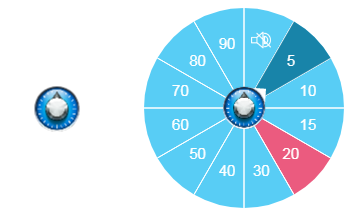

# SonosSound

Ce plugin est un add-on pour le framework [A.V.A.T.A.R](https://github.com/Spikharpax/A.V.A.T.A.R).

Contrôle le volume d'un appareil Sonos par un bouton avec un menu circulaire dans l'interface d'A.V.A.T.A.R
 Nécessite le plugin [SonosPlayer](https://github.com/Spikharpax/Avatar-Plugin-SonosPlayer)

SonosSound est aussi un plugin de démonstration de l'ajout d'éléments avec menu circulaire dans l'interface d'A.V.A.T.A.R
Pour plus d'information: [Cytoscape Menu](https://github.com/cytoscape/cytoscape.js-cxtmenu)

***
## Installation
* Téléchargez le projet depuis la bibliothèque de plug-ins A.V.A.T.A.R

***
## ★ License
Logiciel libre sous [licence MIT](https://github.com/Spikharpax/A.V.A.T.A.R/blob/master/LICENSE)

Copyright (c) 2019 A.V.A.T.A.R - Stéphane Bascher

  
 